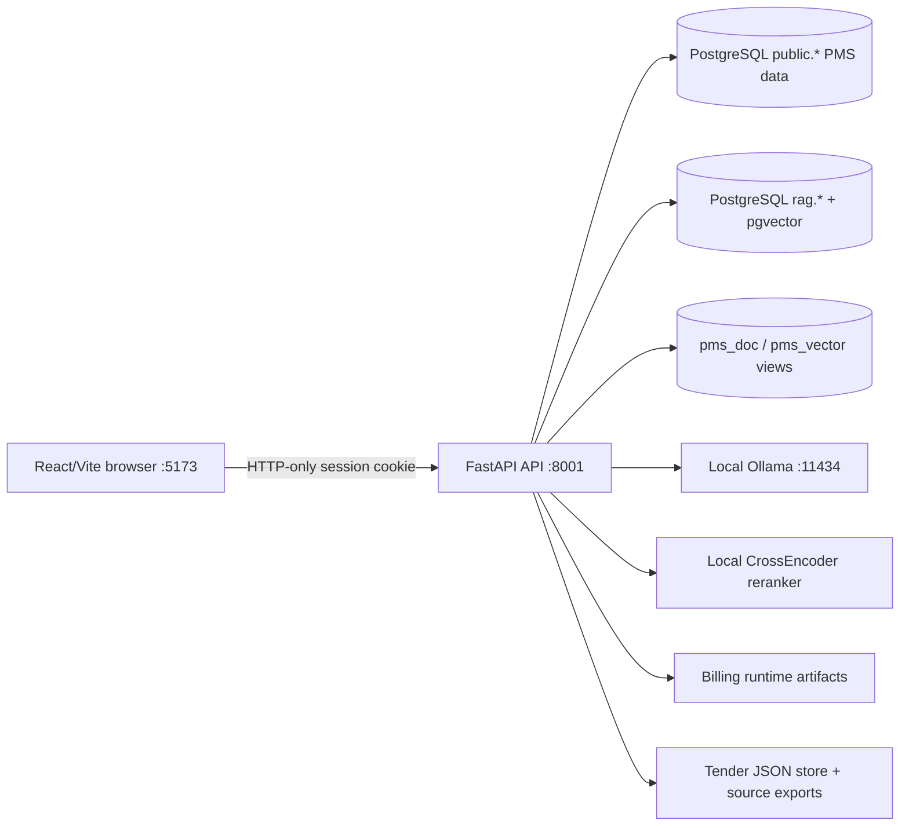
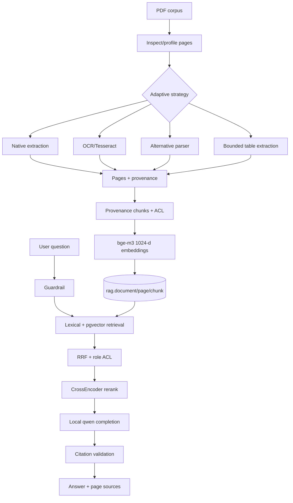
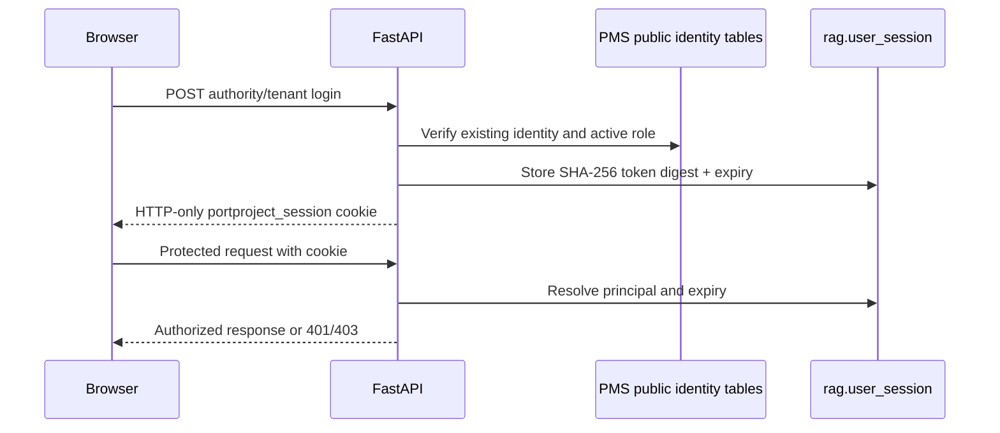
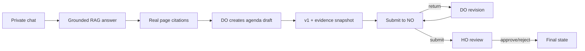
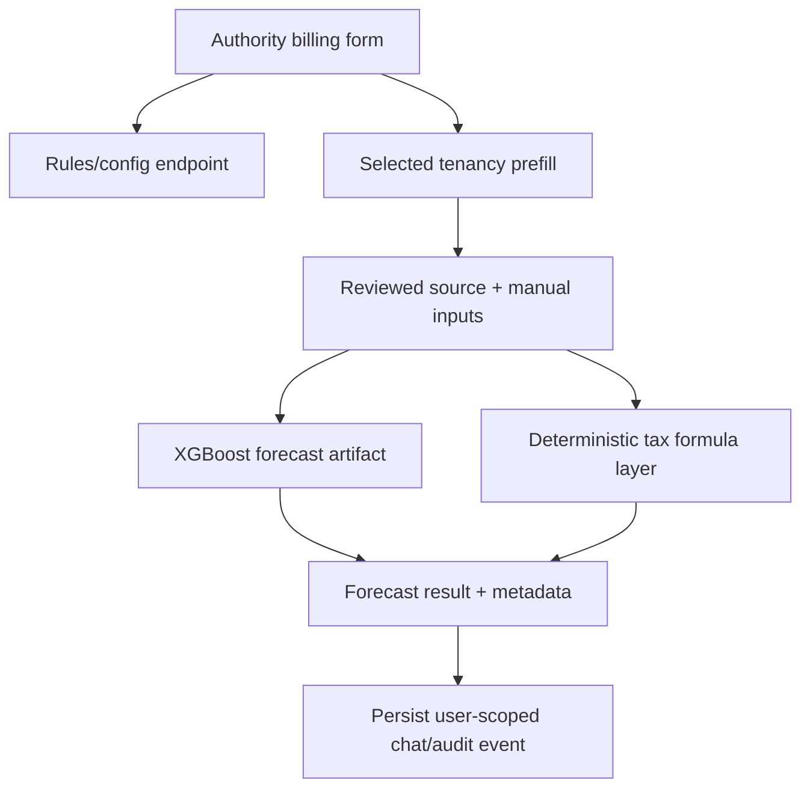
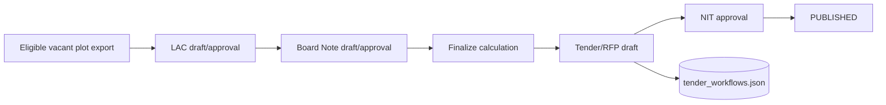
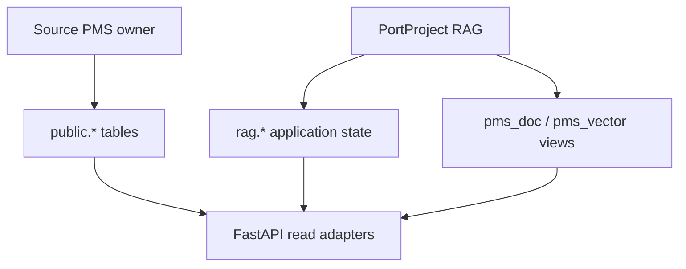

# Architecture diagrams

**Status: CURRENT SOURCE OF TRUTH**

The diagrams use Mermaid so they remain versioned text and render in GitHub and
most Markdown viewers.

## Overall architecture

## RAG pipeline

## Authentication

## Chat to agenda

## Billing flow

## Tender flow

## Database ownership

